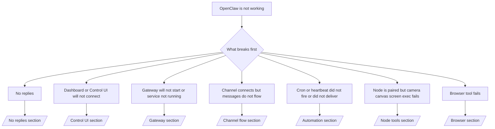

If you only have 2 minutes, use this page as a triage front door.

## First 60 seconds

Run this exact ladder in order:

```bash
openclaw status
openclaw status --all
openclaw gateway probe
openclaw gateway status
openclaw doctor
openclaw channels status --probe
openclaw logs --follow
```

Good output in one line:

- `openclaw status` → shows configured channels and no obvious auth errors.
- `openclaw status --all` → full report is present and shareable.
- `openclaw gateway probe` → expected gateway target is reachable (`Reachable: yes`). `Capability: ...` tells you what auth level the probe could prove, and `Read probe: limited - missing scope: operator.read` is degraded diagnostics, not a connect failure.
- `openclaw gateway status` → `Runtime: running`, `Connectivity probe: ok`, and a plausible `Capability: ...` line. Use `--require-rpc` if you need read-scope RPC proof too.
- `openclaw doctor` → no blocking config/service errors.
- `openclaw channels status --probe` → reachable gateway returns live per-account
  transport state plus probe/audit results such as `works` or `audit ok`; if the
  gateway is unreachable, the command falls back to config-only summaries.
- `openclaw logs --follow` → steady activity, no repeating fatal errors.

## Anthropic long context 429

If you see:
`HTTP 429: rate_limit_error: Extra usage is required for long context requests`,
go to [/gateway/troubleshooting#anthropic-429-extra-usage-required-for-long-context](/gateway/troubleshooting#anthropic-429-extra-usage-required-for-long-context).

## Local OpenAI-compatible backend works directly but fails in OpenClaw

If your local or self-hosted `/v1` backend answers small direct
`/v1/chat/completions` probes but fails on `openclaw infer model run` or normal
agent turns:

1. If the error mentions `messages[].content` expecting a string, set
   `models.providers.<provider>.models[].compat.requiresStringContent: true`.
2. If the backend still fails only on OpenClaw agent turns, set
   `models.providers.<provider>.models[].compat.supportsTools: false` and retry.
3. If tiny direct calls still work but larger OpenClaw prompts crash the
   backend, treat the remaining issue as an upstream model/server limitation and
   continue in the deep runbook:
   [/gateway/troubleshooting#local-openai-compatible-backend-passes-direct-probes-but-agent-runs-fail](/gateway/troubleshooting#local-openai-compatible-backend-passes-direct-probes-but-agent-runs-fail)

## Plugin install fails with missing openclaw extensions

If install fails with `package.json missing openclaw.extensions`, the plugin package
is using an old shape that OpenClaw no longer accepts.

Fix in the plugin package:

1. Add `openclaw.extensions` to `package.json`.
2. Point entries at built runtime files (usually `./dist/index.js`).
3. Republish the plugin and run `openclaw plugins install <package>` again.

Example:

```json
{
  "name": "@openclaw/my-plugin",
  "version": "1.2.3",
  "openclaw": {
    "extensions": ["./dist/index.js"]
  }
}
```

Reference: [Plugin architecture](/plugins/architecture)

## Plugin present but blocked by suspicious ownership

If `openclaw doctor`, setup, or startup warnings show:

```text
blocked plugin candidate: suspicious ownership (... uid=1000, expected uid=0 or root)
plugin present but blocked
```

the plugin files are owned by a different Unix user than the process loading
them. Do not remove the plugin config. Fix the file ownership or run OpenClaw as
the same user that owns the state directory.

Docker installs normally run as `node` (uid `1000`). For the default Docker
setup, repair the host bind mounts:

```bash
sudo chown -R 1000:1000 /path/to/openclaw-config /path/to/openclaw-workspace
openclaw doctor --fix
```

If you intentionally run OpenClaw as root, repair the managed plugin root to
root ownership instead:

```bash
sudo chown -R root:root /path/to/openclaw-config/npm
openclaw doctor --fix
```

Deeper docs:

- [Plugin path ownership](/tools/plugin#blocked-plugin-path-ownership)
- [Docker permissions](/install/docker#permissions-and-eacces)

## Decision tree



### No replies

```bash
    openclaw status
    openclaw gateway status
    openclaw channels status --probe
    openclaw pairing list --channel <channel> [--account <id>]
    openclaw logs --follow
    ```

    Good output looks like:

    - `Runtime: running`
    - `Connectivity probe: ok`
    - `Capability: read-only`, `write-capable`, or `admin-capable`
    - Your channel shows transport connected and, where supported, `works` or `audit ok` in `channels status --probe`
    - Sender appears approved (or DM policy is open/allowlist)

    Common log signatures:

    - `drop guild message (mention required` → mention gating blocked the message in Discord.
    - `pairing request` → sender is unapproved and waiting for DM pairing approval.
    - `blocked` / `allowlist` in channel logs → sender, room, or group is filtered.

    Deep pages:

    - [/gateway/troubleshooting#no-replies](/gateway/troubleshooting#no-replies)
    - [/channels/troubleshooting](/channels/troubleshooting)
    - [/channels/pairing](/channels/pairing)

  ### Dashboard or Control UI will not connect

```bash
    openclaw status
    openclaw gateway status
    openclaw logs --follow
    openclaw doctor
    openclaw channels status --probe
    ```

    Good output looks like:

    - `Dashboard: http://...` is shown in `openclaw gateway status`
    - `Connectivity probe: ok`
    - `Capability: read-only`, `write-capable`, or `admin-capable`
    - No auth loop in logs

    Common log signatures:

    - `device identity required` → HTTP/non-secure context cannot complete device auth.
    - `origin not allowed` → browser `Origin` is not allowed for the Control UI
      gateway target.
    - `AUTH_TOKEN_MISMATCH` with retry hints (`canRetryWithDeviceToken=true`) → one trusted device-token retry may occur automatically.
    - That cached-token retry reuses the cached scope set stored with the paired
      device token. Explicit `deviceToken` / explicit `scopes` callers keep
      their requested scope set instead.
    - On the async Tailscale Serve Control UI path, failed attempts for the same
      `{scope, ip}` are serialized before the limiter records the failure, so a
      second concurrent bad retry can already show `retry later`.
    - `too many failed authentication attempts (retry later)` from a localhost
      browser origin → repeated failures from that same `Origin` are temporarily
      locked out; another localhost origin uses a separate bucket.
    - repeated `unauthorized` after that retry → wrong token/password, auth mode mismatch, or stale paired device token.
    - `gateway connect failed:` → UI is targeting the wrong URL/port or unreachable gateway.

    Deep pages:

    - [/gateway/troubleshooting#dashboard-control-ui-connectivity](/gateway/troubleshooting#dashboard-control-ui-connectivity)
    - [/web/control-ui](/web/control-ui)
    - [/gateway/authentication](/gateway/authentication)

  ### Gateway will not start or service installed but not running

```bash
    openclaw status
    openclaw gateway status
    openclaw logs --follow
    openclaw doctor
    openclaw channels status --probe
    ```

    Good output looks like:

    - `Service: ... (loaded)`
    - `Runtime: running`
    - `Connectivity probe: ok`
    - `Capability: read-only`, `write-capable`, or `admin-capable`

    Common log signatures:

    - `Gateway start blocked: set gateway.mode=local` or `existing config is missing gateway.mode` → gateway mode is remote, or the config file is missing the local-mode stamp and should be repaired.
    - `refusing to bind gateway ... without auth` → non-loopback bind without a valid gateway auth path (token/password, or trusted-proxy where configured).
    - `another gateway instance is already listening` or `EADDRINUSE` → port already taken.

    Deep pages:

    - [/gateway/troubleshooting#gateway-service-not-running](/gateway/troubleshooting#gateway-service-not-running)
    - [/gateway/background-process](/gateway/background-process)
    - [/gateway/configuration](/gateway/configuration)

  ### Channel connects but messages do not flow

```bash
    openclaw status
    openclaw gateway status
    openclaw logs --follow
    openclaw doctor
    openclaw channels status --probe
    ```

    Good output looks like:

    - Channel transport is connected.
    - Pairing/allowlist checks pass.
    - Mentions are detected where required.

    Common log signatures:

    - `mention required` → group mention gating blocked processing.
    - `pairing` / `pending` → DM sender is not approved yet.
    - `not_in_channel`, `missing_scope`, `Forbidden`, `401/403` → channel permission token issue.

    Deep pages:

    - [/gateway/troubleshooting#channel-connected-messages-not-flowing](/gateway/troubleshooting#channel-connected-messages-not-flowing)
    - [/channels/troubleshooting](/channels/troubleshooting)

  ### Cron or heartbeat did not fire or did not deliver

```bash
    openclaw status
    openclaw gateway status
    openclaw cron status
    openclaw cron list
    openclaw cron runs --id <jobId> --limit 20
    openclaw logs --follow
    ```

    Good output looks like:

    - `cron.status` shows enabled with a next wake.
    - `cron runs` shows recent `ok` entries.
    - H